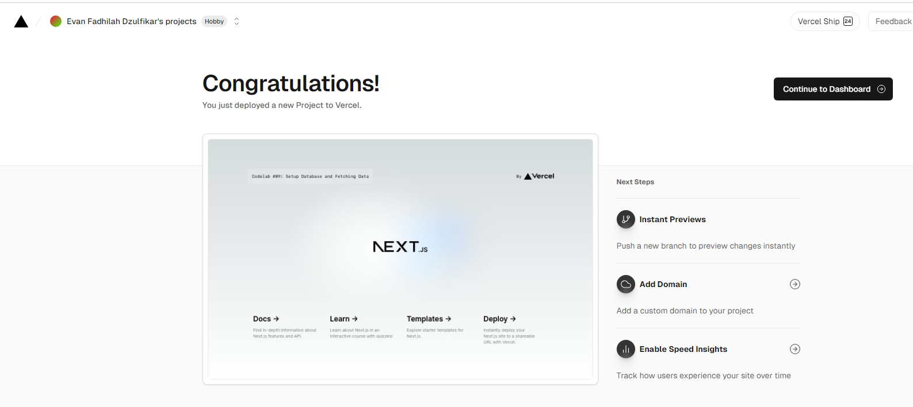
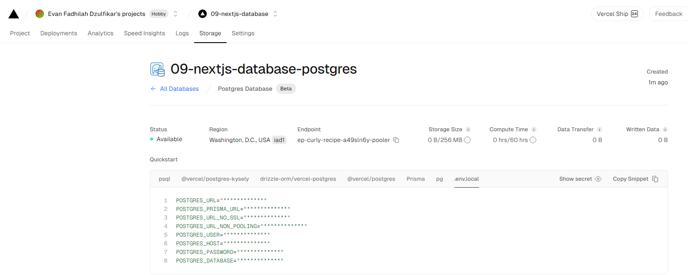

## Laporan Praktikum

|  | Pemrograman Berbasis Framework 2024 |
|--|--|
| NIM |  2141720167|
| Nama |  Evan Fadhilah Dzulfikar |
| Kelas | TI - 3I |

### Practicum 1

## Problem 1

"Capture the results of your deployed project and create a report in the README.md file. Explain what you have learned?"

    We can implement Vercel For building robust and responsive web applications. It allows us to easily deploy our NextJS applications into production with high speed and reliability because its robust infrastructure and rapid deployment capabilities.

    By connecting to GitHub repository, every time we make a change to our main branch, Vercel will automatically redeploy your application with no configuration required.

 

## Problem 2

"Capture your database results and generate a report in the README.md file. Explain what you have learned?"

    We can make online database in Vercel, and the project trying to use Postgres that is a Serverless SQL.

    To configure to our project are connected to that database in Vercel, we need to make .env that store a private configuration. We need to verify that the .gitignore list included .env so it not exposed when we push to our Github repo.

 

