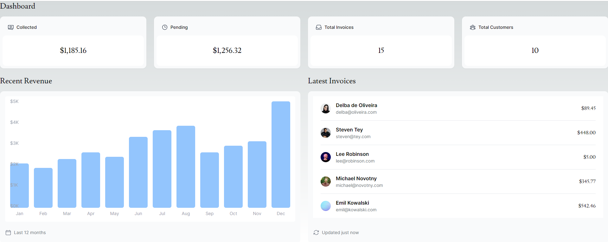
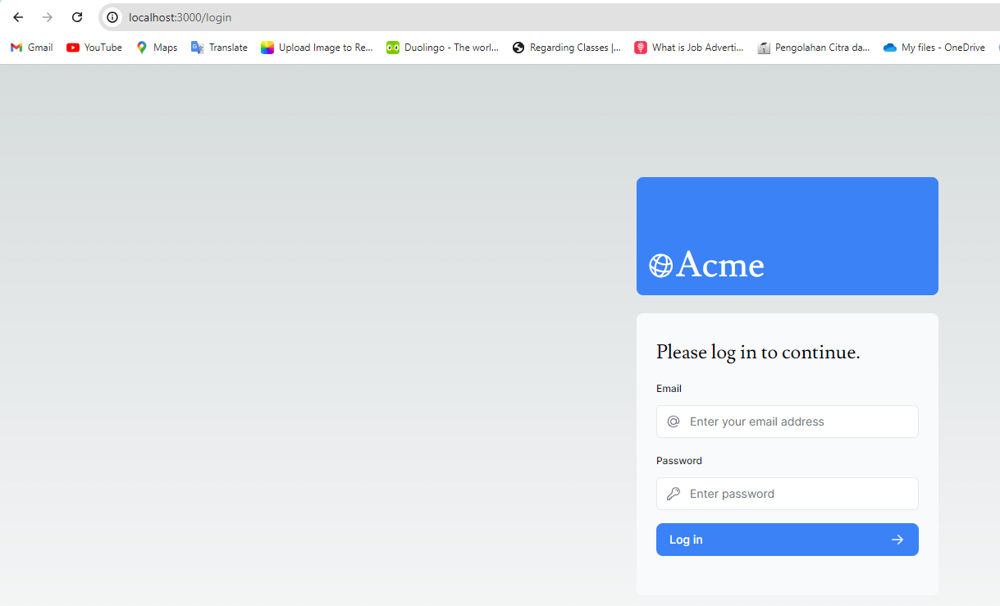
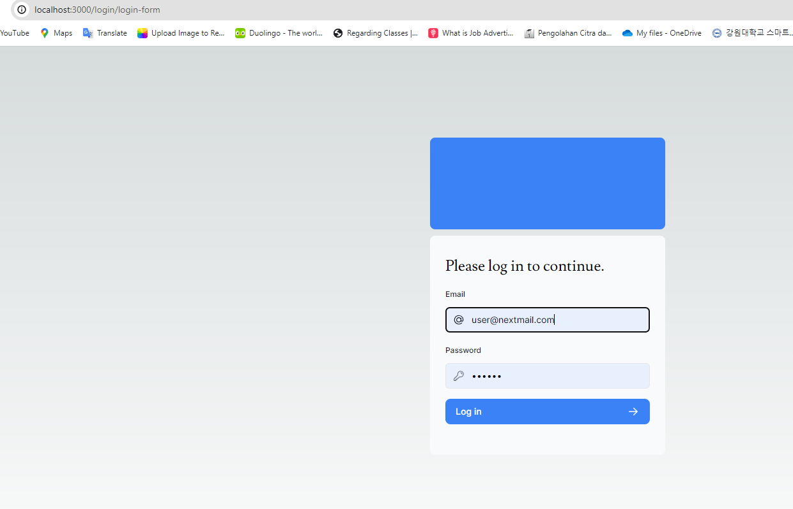
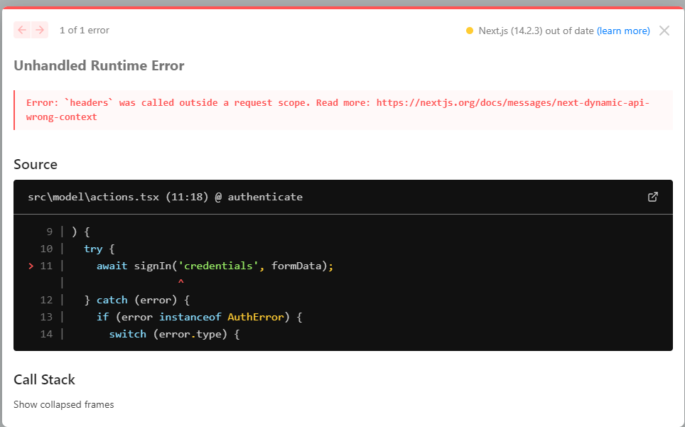
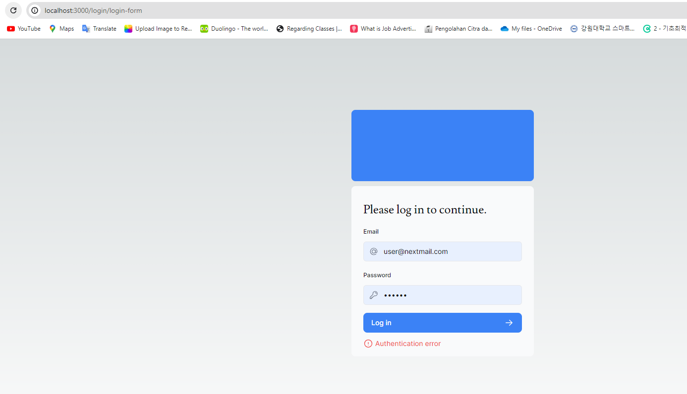
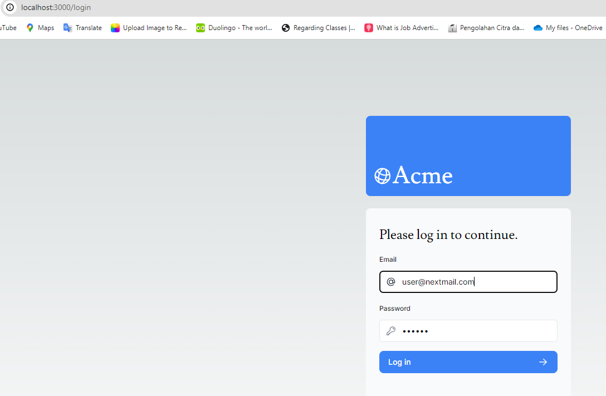

## Laporan Praktikum

|  | Pemrograman Berbasis Framework 2024 |
|--|--|
| NIM |  2141720167|
| Nama |  Evan Fadhilah Dzulfikar |
| Kelas | TI - 3I |

### Practicum 1  

## Problem 1

"Capture the results of your deployed project and create a report in the README.md file. Explain what you have learned?"

    We can implement Vercel For building robust and responsive web applications. It allows us to easily deploy our NextJS applications into production with high speed and reliability because its robust infrastructure and rapid deployment capabilities.

    By connecting to GitHub repository, every time we make a change to our main branch, Vercel will automatically redeploy your application with no configuration required.

 

## Problem 2

"Capture your database results and generate a report in the README.md file. Explain what you have learned?"

    We can make online database in Vercel, and the project trying to use Postgres that is a Serverless SQL.

    To configure to our project are connected to that database in Vercel, we need to make .env that store a private configuration. We need to verify that the .gitignore list included .env so it not exposed when we push to our Github repo.

 

## Problem 3

"Capture the results of your npm run seed and generate a report in the README.md file. Explain what you have learned?"

    We can seed our data to the database using command 'npm run seed'.
    It takes the command from the package.json file in the line scripts and run the "node -r dotenv/config ./src/seeder/seed.js"
    
    Sometimes, it will have problem when doing it for the first time, like in the depedencies or the filepath.

 

## Problem 4

"Capture your query results and report them in the README.md file. Explain what you have learned?"

    We can seed our data to the database using command 'npm run seed'.
    It takes the command from the package.json file in the line scripts and run the "node -r dotenv/config ./src/seeder/seed.js"
    
    Sometimes, it will have problem when doing it for the first time, like in the depedencies or the filepath. 

 

"Try to execute another SQL query according to your creation, capture the results and explain!"

    The table invoices and customer is actually related to each other because have the foreign key 'customer_id'

    With that, we can join the table and see the result of that two table.

 

### Practicum 2  

## Problem 5

"Do a push, then look at your Vercel project dashboard account. Capture and attach a link to your application that has been successfully deployed, then make a report in the README.md file. Explain what you have learned?"

  

    https://09-nextjs-database-woad.vercel.app/  

    The Vercel automatically deploying the latest version of App we have in our Github Reposity. In my Vercel dashboard, it checks the code then deploying it automatically.

 

## Problem 6

"Capture and push the results, then create a report in the README.md file. Explain what you have learned?"

  

    The revenue set the lenght of the graph into 12 (months) and the label make the last month (december) make into a new coloumn below them...
    To fix that we need to add the lenght of graph into 13, but I still hasn't find the way... so I just make the label into fixed and make it into the top of the graph

 

## Problem 7

"Capture and push the results, then create a report in the README.md file. Explain what you have learned?"

  

    The customer photo is saved into the public, and because the photo is not generated when we make a new project. We need to find it ourselves!

 

### Practicum Assignment  

## No.1

"If you pay attention to the src\app\page.tsx file for the Card component, it has actually been created as molecules in the src\app\components\molecules\card.tsx file, namely the CardWrapper component. Please adjust it so that it looks like the following image."

  

    Finish!

 

## No.2

"Pay attention to the fetchCardData() function (in the src\model\query.tsx file) from problem number 1. Explain the purpose of the code and the query carried out in this function!"

    This function fetches summary data for a dashboard card from a PostgreSQL database. 
    It executes three SQL queries in parallel to retrieve the count of invoices, count of customers, and total paid and pending amounts of invoices. 

 

### Week 10  

## Practicum No.1

"Try running it on localhost, capture the results and make a report in README.md. Explain what you have learned and how it looks now? Are there any errors?"

  

    We can use bycrpt to make our website have authentication, in this case because it not redirecting to any page, there is no notification that is been working!

 

## Practicum No.2

  
  
  

 

## Practicum No.3
"Please save everything and run it in your browser. Capture the results and create a report in README.md." 

    1.Are there any errors or features that are not yet working? if not, please fix it! (Not Finished)

  
    Still can't login! 

 

    2.Does accessing the root URL path ( / ) redirect to the login page? if not, please fix it! (Yes)

  
    It redirect!

 